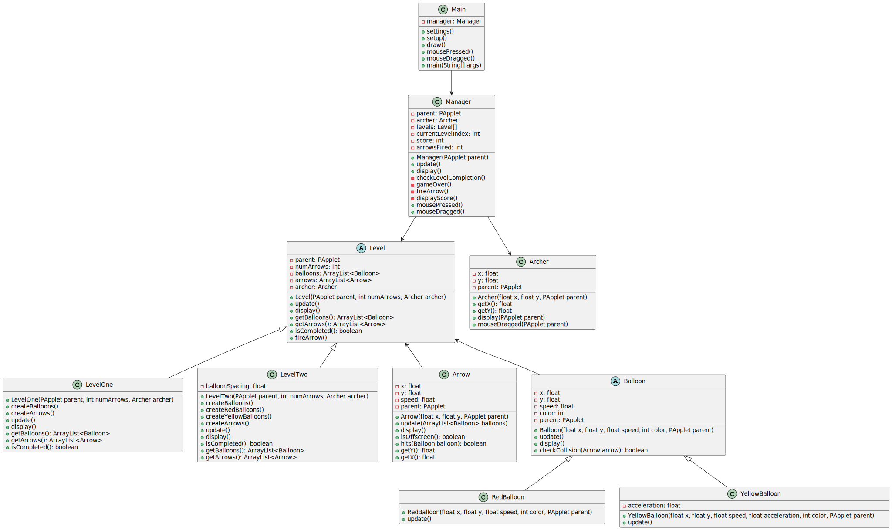
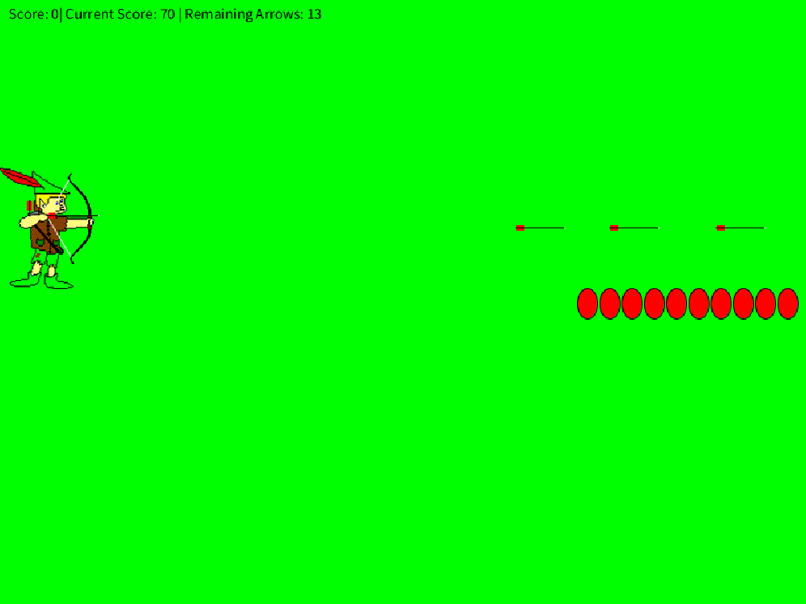

# Archery Game

Welcome to our archery game! This game challenges you to test your archery skills by shooting balloons with your bow and arrow.

## Class Hierarchy
We organized our game into different classes, each responsible for a specific aspect of the gameplay:

- **Main**: This is where the game begins. It sets up the environment and launches the game manager.
  
- **Manager**: Think of the manager as the conductor of the game orchestra. It keeps track of levels, your score, and ensures everything runs smoothly.
  
- **Level**: Levels provide the framework for your archery challenges. Each level is unique, with its own arrangement of balloons and arrows.
  
- **Arrow** and **Balloon**: These classes handle the movement, collision detection, and appearance of arrows and balloons respectively.
  
- **Archer**: This class represents you, the player character. It handles your appearance on the screen and responds to your mouse movements.

### Class Diagram

## Design Choices
We made several decisions to create a fun and engaging gaming experience:

- **Keep It Object-Oriented**: By organizing our code into classes, we can easily manage different game components and make updates without affecting other parts of the game.
  
- **Abstract Thinking**: We used abstract classes like Level and Balloon to provide a blueprint for different aspects of the game. This allows for flexibility in designing levels and adding new balloon types.
  
- **Putting It All Together**: The Manager class acts as the glue that holds everything together. It manages the flow of the game, ensuring smooth transitions between levels and keeping track of your progress.

### Gameplay Screenshot

